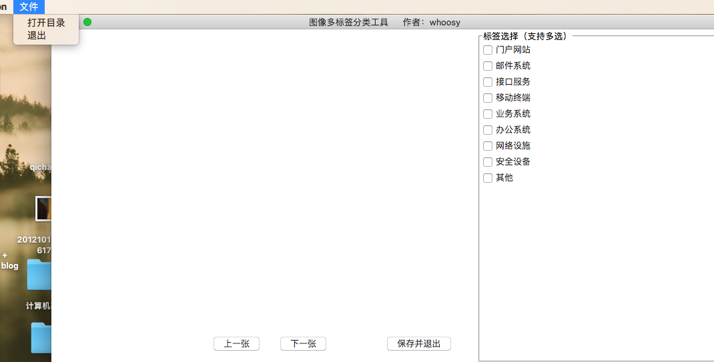
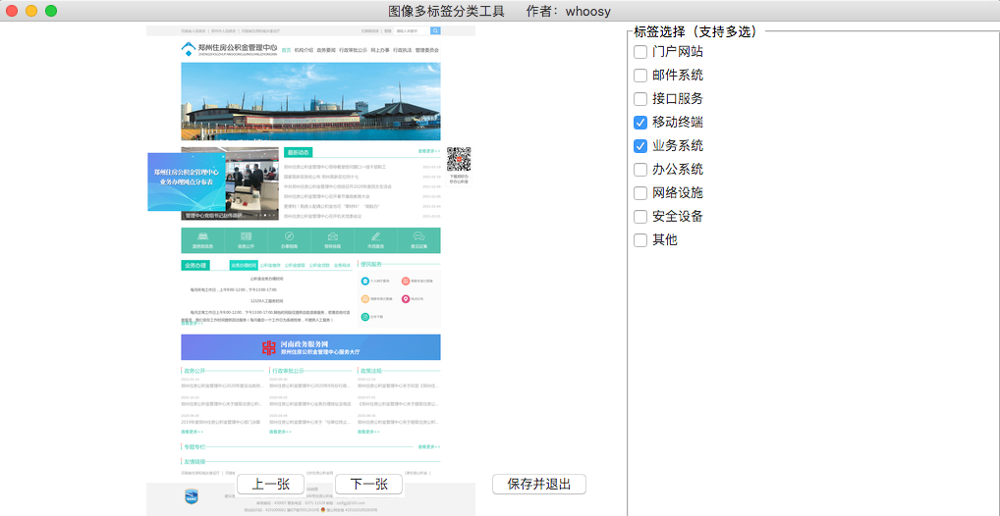
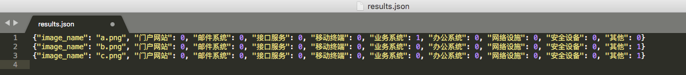

# img-mark-tool

图像多标签标注工具

## 使用方法

labels.ini 填写自己的标签分类

```shell script
git clone https://github.com/who0sy/img-mark-tool.git
cd img-mark-tool
python3 -m venv env #  创建虚拟环境
. env/bin/activate # 切换至虚拟环境
pip install Pillow # 安装依赖
python3 tool.py # 运行工具
```

1. 打开图片目录
   


2. 对每张图片进行分类标注, 然后点击`下一步`
   

3. 所有图片标注完成后点击`保存并退出`，在图片目录会生成`results.json`文件，文件内容如下
   

4. 根据自己所用框架调整`results.json`文件数据格式
